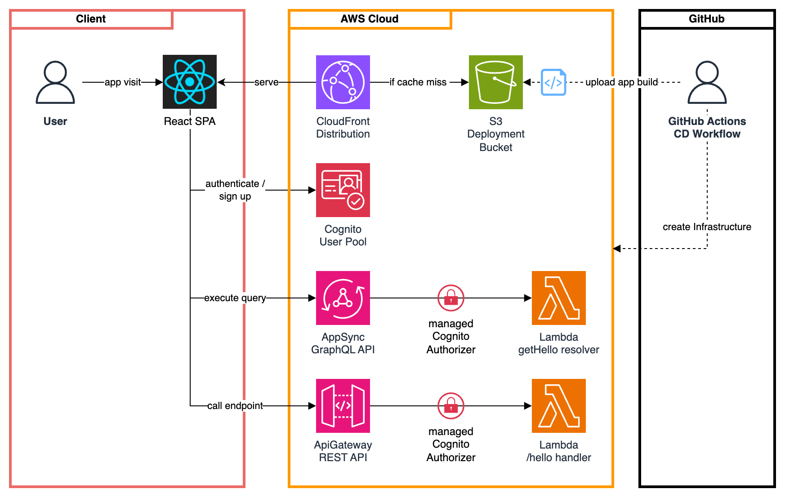

# aws-cdk-react-auth-template

This project is a template for creating a React application hosted on AWS and deployed using the AWS Cloud Development Kit (CDK).
The application uses AWS Cognito for user authentication and authorization.

**Note:** Web app domain will be created within the GitHub Actions CD workflow and outputted to its summary.

The application consists of two TypeScript projects using NPM:

## Frontend Project
See the [frontend package.json](frontend/package.json) for relevant scripts.

To enable the command `npm run serve` you need to create a `.env.dev` file in the `frontend` directory with the following environment variables:
```bash
COGNITO_USER_POOL_ID=<COGNITO_USER_POOL_ID>
COGNITO_USER_POOL_CLIENT_ID=<COGNITO_USER_POOL_CLIENT_ID>
COGNITO_REGION=<COGNITO_REGION>
```
For `npm run build` a similar `.env.build` file is required.

### Amplify Frontend SDK
The frontend uses the [Amplify Frontend SDK](https://docs.amplify.aws/react/) to interact with the AWS Cognito User Pool and provide a basic authentication UI.

See [Amplify Custom Configuration](https://docs.amplify.aws/react/reference/amplify_outputs/#custom-configuration) for more information on how to use the SDK without the Amplify CLI or Amplify Console.

### API Calls
Apart from the Amplify SDK, the frontend implements initial **REST** and **GraphQL** API calls using **Axios** and **Apollo** Client.
Both are configured with tokens provided by the Amplify authentication.

#### REST API
No specific configuration is implemented to call the REST API.
The simple Axios get request can be seen in the [RestApiButton.tsx](frontend/src/components/RestApiButton.tsx) component.
The ID token is set universally within the header in the [App.tsx](frontend/src/App.tsx) component.

#### GraphQL API
The GraphQL schema is defined in the [graphql/schema.graphql](graphql/schema.graphql) file and client queries are defined for the [frontend](frontend/src/graphql/queries.ts) and [backend](frontend/src/graphql/queries.ts).
When changing the schema or queries, the code generation can be triggered using the `npm run codegen` command.
The generated query is used in the [GraphQLApiButton.tsx](frontend/src/components/GraphqlApiButton.tsx) component.
The access token is set within the Apollo Client configuration in the [App.tsx](frontend/src/App.tsx) component.

## Infrastructure Project
See the [infrastructure package.json](infrastructure/package.json) for relevant scripts.
To serve backend requests, a simple backend project is implemented also in TypeScript for two Lambda functions.
See the [backend/src](backend/src) directory for the implementation.

Deploy the infrastructure using the following commands:
```bash
cdk deploy --all --context config=dev --profile <profile> --region <region>
```

The [cdk.json](infrastructure/cdk.json) file tells the CDK Toolkit how to execute your app.

### Infrastructure Overview


### Custom Configuration Settings
The [infrastructure/config.ts](infrastructure/src/config.ts) reads the configuration specified by the `--context config=<CONFIG_NAME` parameter when deploying the CDK stack.
Defined settings can be passed to underlying constructs.

So far this configuration only specifies the `removalPolicy` for AWS resources (see the [dev configuration](config/dev.json)).


## GitHub Actions CI/CD
This project uses GitHub Actions for CI/CD. Two workflows are defined in the [.github/workflows](.github/workflows) directory:
- [ci.yml](.github/workflows/ci.yml) - runs on every push to any branch except `main`
- [cd.yml](.github/workflows/cd.yml) - runs on every push to `main` and deploys the application to AWS

To use the CD workflow and deploy the application an AWS account, you need to set up the following secrets in your GitHub repository:
- `AWS_ACCESS_KEY_ID`
- `AWS_SECRET_ACCESS_KEY`

Before the first deployment, you may need to bootstrap the CDK in your AWS account (see: [Bootstrapping](https://docs.aws.amazon.com/cdk/v2/guide/bootstrapping.html)).:
```bash
npx cdk bootstrap aws://<account>/<region>
```

The CDK outputs are displayed in the GitHub CD workflow run summary.
There you also find the URL to the deployed application.
